# MemPalace - AI 记忆宫殿系统

> 最后更新：2026-04-08 22:41:22

## 项目愿景

MemPalace 是一个**零依赖、本地运行的 AI 记忆系统**，为 AI 助手提供持久化记忆能力。通过"记忆宫殿"隐喻（翅膀-房间-衣柜-抽屉）组织信息，在 LongMemEval 基准测试中达到 **96.6% R@5** 的检索准确率，无需任何 API 密钥或云服务。

**核心哲学**：
- **存储一切，而非摘要**：保存原始对话和文档，让语义搜索决定什么是重要的
- **结构化组织**：通过翅膀（人/项目）、房间（主题）、走廊（记忆类型）建立可导航的知识图谱
- **完全本地**：ChromaDB 向量存储 + SQLite 关系图，所有数据都在用户机器上
- **AI 友好**：通过 MCP 协议提供 19 个工具，让 Claude/ChatGPT/Gemini 自然访问记忆

---

## 架构总览

### 四层记忆栈

| 层级 | 内容 | Token 成本 | 加载时机 |
|------|------|-----------|----------|
| **L0 - Identity** | AI 身份定义（~50 tokens） | 始终加载 | 每次会话 |
| **L1 - Critical Facts** | 关键事实（团队、项目、偏好） | ~120 tokens (AAAK) | 始终加载 |
| **L2 - Room Recall** | 特定主题的近期记忆 | 按需 (~200-500) | 话题相关时 |
| **L3 - Deep Search** | 全宫殿语义搜索 | 按需 (无限制) | 主动查询时 |

**唤醒成本**：L0 + L1 ≈ 170 tokens，对比传统"粘贴所有内容"的 19.5M tokens。

### 核心组件

```
┌─────────────────────────────────────────────────────────────┐
│  用户界面层                                                   │
│  CLI (mempalace命令) + MCP Server (19工具) + Python API    │
└─────────────────────────────────────────────────────────────┘
                              ↓
┌─────────────────────────────────────────────────────────────┐
│  采集层                                                       │
│  miner.py (项目文件) + convo_miner.py (对话导出)            │
│  normalize.py (5种格式转换) + split_mega_files.py          │
└─────────────────────────────────────────────────────────────┘
                              ↓
┌─────────────────────────────────────────────────────────────┐
│  存储层 (双存储引擎)                                          │
│  ChromaDB (抽屉-原始内容) + SQLite (知识图谱-实体关系)      │
└─────────────────────────────────────────────────────────────┘
                              ↓
┌─────────────────────────────────────────────────────────────┐
│  检索层                                                       │
│  searcher.py (语义搜索) + layers.py (四层栈)                │
│  palace_graph.py (房间导航) + knowledge_graph.py (时间查询) │
└─────────────────────────────────────────────────────────────┘
                              ↓
┌─────────────────────────────────────────────────────────────┐
│  压缩层 (可选)                                               │
│  dialect.py (AAAK 压缩 - 30x 有损缩写)                      │
└─────────────────────────────────────────────────────────────┘
```

---

## 模块结构图

```mermaid
graph TD
    A["(根) MemPalace"] --> B["mempalace/ - 核心包"];
    A --> C["benchmarks/ - 基准测试"];
    A --> D["tests/ - 测试套件"];
    A --> E["hooks/ - 自动保存钩子"];
    A --> F["examples/ - 使用示例"];

    B --> B1["cli.py - CLI 入口"];
    B --> B2["mcp_server.py - MCP 服务器"];
    B --> B3["miner.py - 项目文件采集"];
    B --> B4["convo_miner.py - 对话采集"];
    B --> B5["searcher.py - 语义搜索"];
    B --> B6["knowledge_graph.py - 知识图谱"];
    B --> B7["layers.py - 四层记忆栈"];
    B --> B8["dialect.py - AAAK 压缩"];
    B --> B9["normalize.py - 格式转换"];
    B --> B10["palace_graph.py - 房间导航"];

    C --> C1["longmemeval_bench.py"];
    C --> C2["locomo_bench.py"];
    C --> C3["convomem_bench.py"];
    C --> C4["membench_bench.py"];

    click B "./mempalace/CLAUDE.md" "查看核心包文档"
    click C "./benchmarks/CLAUDE.md" "查看基准测试文档"
```



---

## 模块索引

| 模块路径 | 职责 | 语言 | 测试覆盖 |
|---------|------|------|----------|
| **mempalace/** | 核心功能包 | Python | ✅ 10+ 测试文件 |
| **benchmarks/** | 可复现基准测试 | Python | ✅ 独立测试脚本 |
| **tests/** | 测试套件 | pytest | ✅ 覆盖核心模块 |
| **hooks/** | Claude Code 自动保存 | Shell | ✅ 文档示例 |
| **examples/** | 使用示例 | Python/MD | ✅ 多种场景 |

---

## 快速开始

### 安装与初始化

```bash
# 安装
pip install mempalace

# 初始化宫殿（检测项目结构）
mempalace init ~/projects/myapp

# 采集数据
mempalace mine ~/projects/myapp                    # 项目文件
mempalace mine ~/chats/ --mode convos              # 对话导出
mempalace mine ~/chats/ --mode convos --extract general  # 自动分类

# 搜索
mempalace search "why did we switch to GraphQL"
```

### MCP 集成（Claude/ChatGPT/Gemini）

```bash
# 连接 MemPalace 到 AI
claude mcp add mempalace -- python -m mempalace.mcp_server

# 现在 AI 有 19 个可用工具
# AI 自动学习 AAAK 规范和记忆协议
```

### 本地模型集成（Llama/Mistral）

```bash
# 方式 1: 唤醒命令
mempalace wake-up > context.txt  # ~170 tokens 关键事实
# 将 context.txt 粘贴到本地模型的系统提示

# 方式 2: 按需搜索
mempalace search "auth decisions" > results.txt
# 将 results.txt 包含在提示中
```

---

## 运行与开发

### 本地开发环境

```bash
# 克隆仓库
git clone https://github.com/milla-jovovich/mempalace.git
cd mempalace

# 安装开发依赖
pip install -e ".[dev]"

# 运行测试
pytest tests/ -v

# 运行基准测试
python benchmarks/longmemeval_bench.py /path/to/data --limit 20
```

### 核心命令

| 命令 | 功能 |
|------|------|
| `mempalace init <dir>` | 初始化宫殿，检测房间 |
| `mempalace mine <dir>` | 采集项目文件 |
| `mempalace mine <dir> --mode convos` | 采集对话导出 |
| `mempalace search <query>` | 语义搜索 |
| `mempalace wake-up` | 显示 L0+L1 唤醒上下文 |
| `mempalace status` | 宫殿状态概览 |
| `mempalace split <dir>` | 分割巨型对话文件 |
| `mempalace compress --wing <name>` | AAAK 压缩 |

---

## 测试策略

### 测试文件结构

```
tests/
├── conftest.py                    # pytest 配置
├── test_config.py                 # 配置系统测试
├── test_convo_miner.py            # 对话采集测试
├── test_dialect.py                # AAAK 压缩测试
├── test_knowledge_graph.py        # 知识图谱测试
├── test_mcp_server.py             # MCP 服务器测试
├── test_miner.py                  # 项目采集测试
├── test_normalize.py              # 格式转换测试
├── test_searcher.py               # 搜索功能测试
├── test_split_mega_files.py       # 文件分割测试
└── test_version_consistency.py    # 版本一致性测试
```

### 基准测试

| 基准 | 分数 | API 调用 | 耗时 |
|------|------|---------|------|
| **LongMemEval R@5** (Raw) | **96.6%** | 0 | ~5 分钟 |
| **LongMemEval R@5** (AAAK) | 84.2% | 0 | ~5 分钟 |
| **LoCoMo R@10** | 60.3% | 0 | ~2 分钟 |
| **ConvoMem Avg** | 92.9% | 0 | ~2 分钟 |

运行基准测试：
```bash
# 下载 LongMemEval 数据
curl -fsSL -o /tmp/longmemeval-data/longmemeval_s_cleaned.json \
  https://huggingface.co/datasets/xiaowu0162/longmemeval-cleaned/resolve/main/longmemeval_s_cleaned.json

# 运行完整基准（500 问题）
python benchmarks/longmemeval_bench.py /tmp/longmemeval-data/longmemeval_s_cleaned.json

# 快速测试（20 问题）
python benchmarks/longmemeval_bench.py /tmp/longmemeval-data/longmemeval_s_cleaned.json --limit 20
```

---

## 编码规范

### 代码风格

- **格式化**：[Ruff](https://docs.astral.sh/ruff/)，100 字符行限制
- **命名**：函数/变量用 `snake_case`，类用 `PascalCase`
- **文档字符串**：所有模块和公共函数都需要
- **类型提示**：在提高可读性的地方添加

### 依赖原则

- **最小化依赖**：仅 ChromaDB + PyYAML
- **零 API 默认**：核心功能必须无需 API 密钥即可工作
- **本地优先**：所有数据存储在用户机器上

### 提交规范

遵循 [Conventional Commits](https://www.conventionalcommits.org/)：
- `feat: 添加 Notion 导出格式`
- `fix: 处理空对话文件`
- `docs: 更新 MCP 工具描述`
- `bench: 添加 LoCoMo turn-level 指标`

---

## AI 使用指引

### 与 Claude Code 集成

1. **安装 MCP 服务器**：
   ```bash
   claude mcp add mempalace -- python -m mempalace.mcp_server
   ```

2. **Claude 自动学习**：
   - 首次唤醒时调用 `mempalace_status` 学习 AAAK 规范
   - 遵循"Palace Protocol"（先查询，再回答）
   - 每 15 条消息自动保存关键事实

3. **可用工具**（19 个）：
   - **读取**：`mempalace_status`, `mempalace_search`, `mempalace_kg_query`, `mempalace_list_wings`, `mempalace_list_rooms`
   - **写入**：`mempalace_add_drawer`, `mempalace_diary_write`
   - **导航**：`mempalace_traverse`, `mempalace_find_tunnels`
   - **图谱**：`mempalace_kg_add`, `mempalace_kg_invalidate`, `mempalace_kg_timeline`

### 与本地模型集成

**方法 1 - 唤醒命令**：
```bash
mempalace wake-up > context.txt  # ~170 tokens
# 将 context.txt 作为系统提示的一部分
```

**方法 2 - Python API**：
```python
from mempalace.searcher import search_memories
results = search_memories("auth decisions", palace_path="~/.mempalace/palace")
# 将 results 注入到提示中
```

### AAAK 压缩格式

AAAK 是一种**有损缩写方言**，用于在上下文窗口中打包更多信息：

```
格式：
  实体：3 字母大写代码（ALC=Alice, JOR=Jordan）
  情感：*动作标记* (*warm*=喜悦, *fierce*=决心)
  结构：管道分隔字段 FAM: 家庭 | PROJ: 项目 | ⚠: 警告
  日期：ISO 格式 (2026-03-31)
  重要性：★ 到 ★★★★★

示例：
  FAM: ALC→♡JOR | 2D(kids): RIL(18,sports) MAX(11,chess) | BEN(contributor)
```

**注意**：AAAK 目前在 LongMemEval 上**低于原始模式**（84.2% vs 96.6%）。默认存储使用原始逐字文本。

---

## 变更记录

### 2026-04-08 - 初始化 AI 上下文文档 🚀

- ✅ **创建根级 CLAUDE.md**：
  - 项目愿景与核心哲学
  - 完整架构总览（四层记忆栈）
  - Mermaid 模块结构图
  - 快速开始指南
  - 测试策略与基准测试结果
  - 编码规范与 AI 使用指引

- 📊 **项目分析完成**：
  - 总文件数：~120 个
  - 核心模块：27 个 Python 文件
  - 测试文件：10 个
  - 基准测试：4 个独立测试套件
  - MCP 工具：19 个

- 🔧 **技术栈识别**：
  - 语言：Python 3.9+
  - 存储：ChromaDB (向量) + SQLite (图谱)
  - 压缩：自定义 AAAK 方言
  - 集成：MCP 协议（Claude/Gemini/Cursor）

- 📖 **文档覆盖**：
  - ✅ 根级文档完成
  - ✅ 模块结构图生成
  - 📋 待生成模块级文档

---

## 相关资源

- **主页**：https://github.com/milla-jovovich/mempalace
- **文档**：[README.md](README.md)
- **基准测试**：[benchmarks/README.md](benchmarks/README.md)
- **贡献指南**：[CONTRIBUTING.md](CONTRIBUTING.md)
- **Discord**：https://discord.com/invite/ycTQQCu6kn
