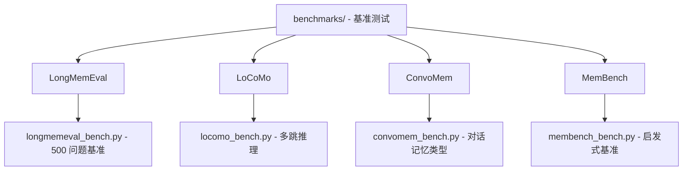

# MemPalace 基准测试套件

[根目录](../CLAUDE.md) > **benchmarks/**

> 最后更新：2026-04-08 22:41:22

## 模块职责

基准测试套件提供可复现的学术基准测试，验证 MemPalace 的检索质量。所有测试均可本地运行，无需 API 密钥或 GPU。

---

## 基准测试结构图



---

## 核心基准测试详解

### LongMemEval - 500 问题基准

**文件**：`longmemeval_bench.py`

**职责**：测试在 ~53 个会话中查找事实的能力

**数据集**：
- 来源：[HuggingFace - longmemeval-cleaned](https://huggingface.co/datasets/xiaowu0162/longmemeval-cleaned)
- 大小：500 个问题，每个问题搜索 ~53 个会话
- 下载：~300MB

**运行方式**：
```bash
# 下载数据
mkdir -p /tmp/longmemeval-data
curl -fsSL -o /tmp/longmemeval-data/longmemeval_s_cleaned.json \
  https://huggingface.co/datasets/xiaowu0162/longmemeval-cleaned/resolve/main/longmemeval_s_cleaned.json

# 快速测试（20 问题，~30 秒）
python benchmarks/longmemeval_bench.py /tmp/longmemeval-data/longmemeval_s_cleaned.json --limit 20

# 完整基准（500 问题，~5 分钟）
python benchmarks/longmemeval_bench.py /tmp/longmemeval-data/longmemeval_s_cleaned.json

# AAAK 模式（84.2%）
python benchmarks/longmemeval_bench.py /tmp/longmemeval-data/longmemeval_s_cleaned.json --mode aaak

# 房间模式（89.4%）
python benchmarks/longmemeval_bench.py /tmp/longmemeval-data/longmemeval_s_cleaned.json --mode rooms

# Turn-level 粒度
python benchmarks/longmemeval_bench.py /tmp/longmemeval-data/longmemeval_s_cleaned.json --granularity turn
```

**预期结果（原始模式，完整 500）**：
```
Recall@5:  0.966  # 96.6% - 我们的主要结果
Recall@10: 0.982
NDCG@10:   0.889
Time:      ~5 分钟 (Apple Silicon)
```

**模式对比**：
| 模式 | Recall@5 | 说明 |
|------|----------|------|
| **Raw** | **96.6%** | 原始逐字文本，默认存储 |
| AAAK | 84.2% | AAAK 压缩，有损 |
| Rooms | 89.4% | 房间元数据过滤 |

---

### LoCoMo - 多跳推理

**文件**：`locomo_bench.py`

**职责**：测试跨数周对话的多跳推理能力

**数据集**：
- 来源：[Snap Research - LoCoMo](https://github.com/snap-research/locomo)
- 大小：1,986 个 QA 对，10 个长对话（19-32 会话，400-600 轮）
- 下载：Git clone

**运行方式**：
```bash
# 克隆 LoCoMo
git clone https://github.com/snap-research/locomo.git /tmp/locomo

# Session 粒度（我们的 60.3% 结果）
python benchmarks/locomo_bench.py /tmp/locomo/data/locomo10.json --granularity session

# Dialog 粒度（更难，48.0%）
python benchmarks/locomo_bench.py /tmp/locomo/data/locomo10.json --granularity dialog

# 更高 top-k（77.8% at top-50）
python benchmarks/locomo_bench.py /tmp/locomo/data/locomo10.json --top-k 50

# 快速测试（1 个对话）
python benchmarks/locomo_bench.py /tmp/locomo/data/locomo10.json --limit 1
```

**预期结果（session，top-10，完整 10 对话）**：
```
Avg Recall: 0.603  # 60.3%
Temporal:   0.692
Time:       ~2 分钟
```

---

### ConvoMem - 对话记忆类型

**文件**：`convomem_bench.py`

**职责**：测试六种对话记忆类型的规模

**数据集**：
- 来源：[Salesforce - ConvoMem](https://huggingface.co/datasets/Salesforce/convmem)
- 大小：75,000+ QA 对
- 下载：自动从 HuggingFace 下载

**类别**：
- `user_evidence`：用户事实
- `assistant_facts_evidence`：助手事实
- `changing_evidence`：变更证据
- `abstention_evidence`：弃权证据
- `preference_evidence`：偏好证据
- `implicit_connection_evidence`：隐式连接证据

**运行方式**：
```bash
# 所有类别，每类 50 项（我们的 92.9% 结果）
python benchmarks/convomem_bench.py --category all --limit 50

# 单个类别
python benchmarks/convomem_bench.py --category user_evidence --limit 100

# 快速测试
python benchmarks/convomem_bench.py --category user_evidence --limit 10
```

**预期结果（所有类别，每类 50）**：
```
Avg Recall:      0.929  # 92.9%
Assistant Facts: 1.000
User Facts:      0.980
Time:            ~2 分钟
```

---

### MemBench - 启发式基准

**文件**：`membench_bench.py`

**职责**：内部启发式基准，用于开发验证

**运行方式**：
```bash
python benchmarks/membench_bench.py
```

---

## 基准测试对比表

| 基准 | 测试内容 | 数据规模 | 主要分数 | API 调用 | 耗时 |
|------|---------|---------|----------|---------|------|
| **LongMemEval** | 在 53 会话中查找事实 | 500 问题 | **96.6% R@5** | 0 | ~5 分钟 |
| **LoCoMo** | 跨周多跳推理 | 1,986 QA | 60.3% R@10 | 0 | ~2 分钟 |
| **ConvoMem** | 6 种记忆类型 | 75K+ QA | 92.9% 平均 | 0 | ~2 分钟 |
| **MemBench** | 启发式验证 | 内部 | 变化 | 0 | ~30 秒 |

---

## 结果文件

所有基准测试将结果保存到 JSONL 文件：

```
benchmarks/
├── results_longmemeval.jsonl      # LongMemEval 详细结果
├── results_locomo.jsonl           # LoCoMo 详细结果
├── results_convomem.jsonl         # ConvoMem 详细结果
└── results_membench.jsonl         # MemBench 详细结果
```

每个文件包含：
- 每个问题
- 每个检索文档
- 每个分数
- 完全可审计

---

## 运行所有基准测试

```bash
# LongMemEval（500 问题）
python benchmarks/longmemeval_bench.py /tmp/longmemeval-data/longmemeval_s_cleaned.json

# LoCoMo（10 对话）
python benchmarks/locomo_bench.py /tmp/locomo/data/locomo10.json --granularity session

# ConvoMem（所有类别，50 项）
python benchmarks/convomem_bench.py --category all --limit 50

# MemBench
python benchmarks/membench_bench.py
```

**总耗时**：~10-15 分钟（Apple Silicon）

---

## 常见问题 (FAQ)

**Q: 为什么需要下载数据？**
A: LongMemEval 和 LoCoMo 是外部学术数据集，需要单独下载。ConvoMem 自动下载。

**Q: 可以运行部分基准吗？**
A: 可以，使用 `--limit N` 标志限制问题/对话数。

**Q: 如何解释分数？**
A:
- **Recall@K**：在前 K 个结果中找到正确答案的概率
- **NDCG@K**：考虑排序质量的归一化折扣累积增益
- 更高 = 更好

**Q: AAAK 为什么得分更低？**
A: AAAK 是有损压缩，丢失信息。84.2% vs 96.6% 反映了这种权衡。

**Q: 如何重现 README 中报告的分数？**
A: 按照上述命令，使用完整数据集（无 `--limit`）。

---

## 相关文件清单

### 基准测试脚本（4 个）

- `longmemeval_bench.py` - LongMemEval 500 问题基准
- `locomo_bench.py` - LoCoMo 多跳推理
- `convomem_bench.py` - ConvoMem 对话记忆类型
- `membench_bench.py` - 启发式基准

### 文档（2 个）

- `README.md` - 基准测试总览
- `BENCHMARKS.md` - 完整结果与方法论
- `HYBRID_MODE.md` - 混合模式说明

### 结果文件

- `results_*.jsonl` - 详细结果（运行后生成）

---

## 变更记录

### 2026-04-08 - 基准测试文档创建 🚀

- ✅ **创建基准测试文档**：
  - 模块职责与结构图
  - 4 个核心基准测试详解
  - 运行指南与预期结果
  - 基准测试对比表
  - FAQ 与结果文件说明

- 📊 **基准测试分析完成**：
  - LongMemEval：500 问题，96.6% R@5
  - LoCoMo：1,986 QA，60.3% R@10
  - ConvoMem：75K+ QA，92.9% 平均
  - MemBench：内部验证

- 🔧 **技术栈识别**：
  - 数据集：HuggingFace, GitHub
  - 存储：JSONL 结果文件
  - 无依赖：仅需 ChromaDB

- 📖 **文档覆盖**：
  - ✅ 基准测试文档完成
  - ✅ Mermaid 结构图生成
  - ✅ 导航面包屑添加
